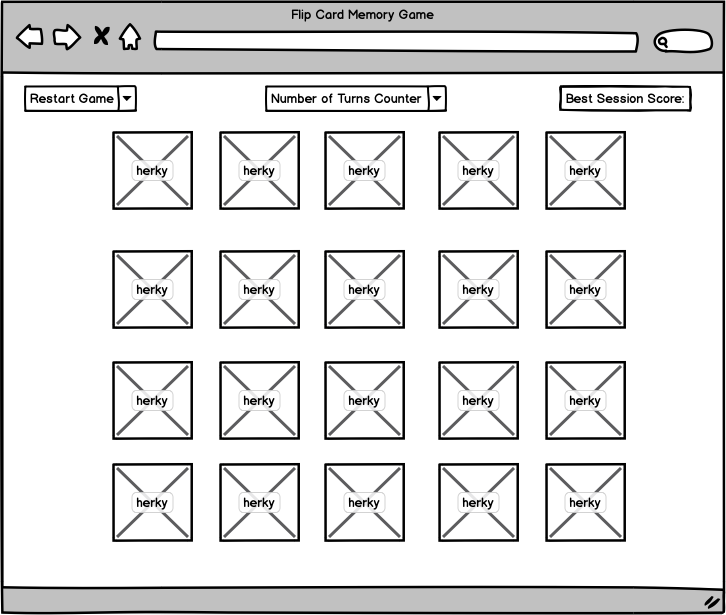
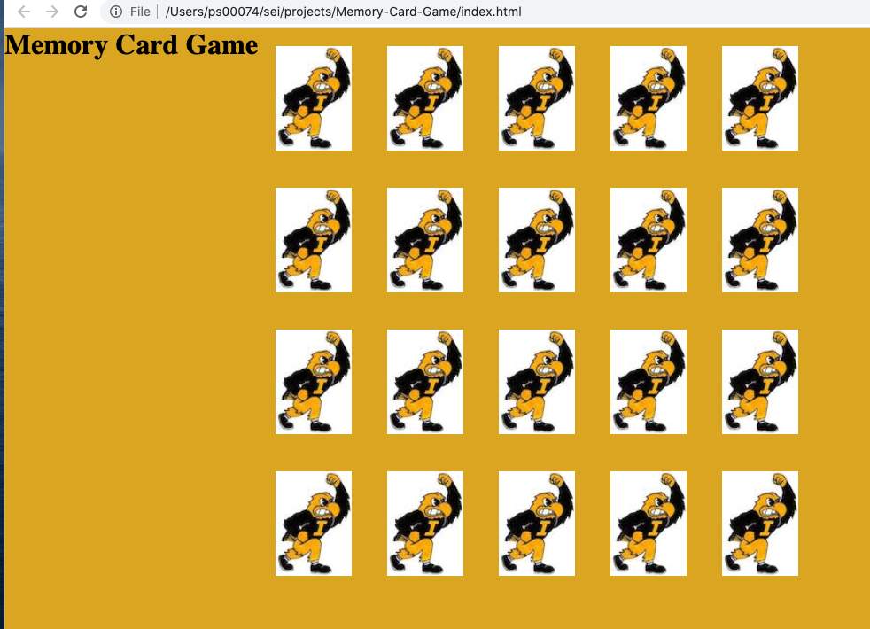

# Memory-Card-Game

Memory Card Game

* Description
o A simple memory card game with an Iowa Hawkeye Sports theme.
o Flip two cards at a time, attempting to match the paired images, and remembering where the previous card was in the grid in an unmatched instance.
* Brief Example
Wireframe:

Browser Screenshot:

* List of Features / User Stories
Bronze
As a user I should be able to restart the game
As a user the game should present a new random order of shuffled cards
Silver
turns counter logs number of turns in current game
best score denotes lowest number of turns in a game during current session
Gold
allow user to select difficulty level	-easy, hard, expert
let user select number of cards for game
successfully solving all matches reveals picture / saying, etc. on background image

	

* List of Technologies Used
o Vanilla JavaScript, HTML, CSS

* Installation Instructions / Getting Started
o Click on link to run in browser

* Contribution Guidelines
Balsamiq Wireframes
W3Schools.com
JSFiddle.net card flip examples 
Stack overflow.com

